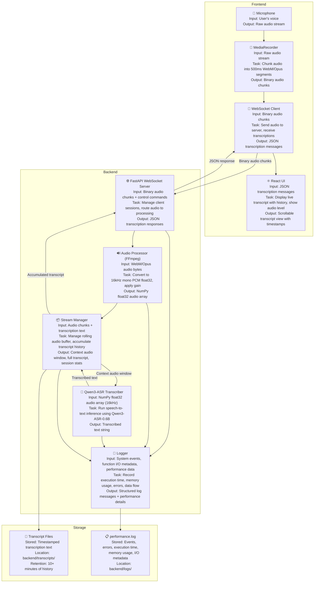

# System Architecture Diagram

```mermaid

graph TD

    %% Frontend
    subgraph Frontend
        Microphone["🎤 Microphone
        Input: User's voice
        Output: Raw audio stream"]

        MediaRecorder["🔴 MediaRecorder
        Input: Raw audio stream
        Task: Chunk audio into 500ms WebM/Opus segments
        Output: Binary audio chunks"]

        WebSocketClient["🔌 WebSocket Client
        Input: Binary audio chunks
        Task: Send audio to server, receive transcriptions
        Output: JSON transcription messages"]

        ReactUI["⚛️ React UI
        Input: JSON transcription messages
        Task: Display live transcript with history, show audio level
        Output: Scrollable transcript view with timestamps"]
    end

    %% Backend
    subgraph Backend
        FastAPIServer["🌐 FastAPI WebSocket Server
        Input: Binary audio chunks + control commands
        Task: Manage client sessions, route audio to processing
        Output: JSON transcription responses"]

        AudioProcessor["🔊 Audio Processor (FFmpeg)
        Input: WebM/Opus audio bytes
        Task: Convert to 16kHz mono PCM float32, apply gain
        Output: NumPy float32 audio array"]

        QwenASR["🤖 Qwen3-ASR Transcriber
        Input: NumPy float32 audio array (16kHz)
        Task: Run speech-to-text inference using Qwen3-ASR-0.6B
        Output: Transcribed text string"]

        StreamManager["📦 Stream Manager
        Input: Audio chunks + transcription text
        Task: Manage rolling audio buffer, accumulate transcript history
        Output: Context audio window, full transcript, session stats"]

        AppLogger["📝 Logger
        Input: System events, function I/O metadata, performance data
        Task: Record execution time, memory usage, errors, data flow
        Output: Structured log messages + performance details"]
    end

    %% Storage
    subgraph Storage
        TranscriptFile["📄 Transcript Files
        Stored: Timestamped transcription text
        Location: backend/transcripts/
        Retention: 10+ minutes of history"]

        LogFile["📋 performance.log
        Stored: Events, errors, execution time,
        memory usage, I/O metadata
        Location: backend/logs/"]
    end

    %% Connections
    Microphone --> MediaRecorder
    MediaRecorder --> WebSocketClient
    WebSocketClient -->|Binary audio chunks| FastAPIServer
    FastAPIServer --> AudioProcessor
    AudioProcessor --> StreamManager
    StreamManager -->|Context audio window| QwenASR
    QwenASR -->|Transcribed text| StreamManager
    StreamManager -->|Accumulated transcript| FastAPIServer
    FastAPIServer -->|JSON response| WebSocketClient
    WebSocketClient --> ReactUI
    StreamManager --> TranscriptFile
    FastAPIServer --> AppLogger
    AudioProcessor --> AppLogger
    QwenASR --> AppLogger
    StreamManager --> AppLogger
    AppLogger --> LogFile

```
