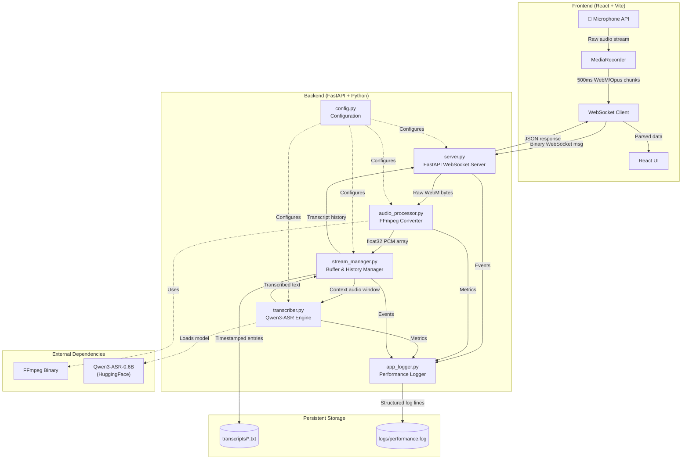

# Component-Level Diagram

Detailed breakdown of every component in the Real-Time STT System, showing inputs, processing logic, outputs, and dependencies for each module.

## Component Interaction Diagram

---

## 1. Audio Processor (`audio_processor.py`)

| Attribute | Detail |
|-----------|--------|
| **Purpose** | Convert incoming WebM/Opus audio from the browser into 16kHz mono PCM float32 arrays suitable for Qwen ASR |
| **Dependencies** | `subprocess`, `numpy`, `FFmpeg` (binary), `config.py` |

### Functions

#### `convert_audio_to_pcm(audio_bytes: bytes) → np.ndarray | None`

| | Description |
|---|---|
| **Input** | Raw audio bytes from the WebSocket client (WebM/Opus format, typically 500ms chunks) |
| **Processing** | 1. Validate input size (reject < 100 bytes) |
|  | 2. Spawn FFmpeg subprocess: pipe WebM bytes → resample to 16kHz mono → output raw PCM float32 |
|  | 3. Parse FFmpeg stdout as `np.float32` array |
|  | 4. Apply software gain boost (`AUDIO_GAIN`, default 5.0x) |
|  | 5. Clean NaN/Inf values, clip to [-1.0, 1.0] |
| **Output** | `np.ndarray` of float32 PCM samples, or `None` on failure |
| **Complexity** | Time: O(n) where n = number of audio samples. Space: O(n) for the output array |
| **Error Handling** | FFmpeg timeout (10s), non-zero exit codes, empty output |
| **Decorator** | `@log_performance` — logs execution time, memory delta, I/O sizes |

#### `get_audio_level(audio: np.ndarray) → float`

| | Description |
|---|---|
| **Input** | numpy float32 audio array |
| **Processing** | Calculate RMS: `sqrt(mean(audio²))` |
| **Output** | Float value in [0.0, 1.0] for UI visualization |
| **Complexity** | Time: O(n), Space: O(1) |

---

## 2. Qwen ASR Transcriber (`transcriber.py`)

| Attribute | Detail |
|-----------|--------|
| **Purpose** | Load and manage the Qwen3-ASR-0.6B model for speech-to-text inference |
| **Dependencies** | `qwen_asr`, `numpy`, `torch`, `config.py` |

### Class: `QwenTranscriber`

| Attribute | Type | Description |
|-----------|------|-------------|
| `model_name` | `str` | HuggingFace model identifier (default: `Qwen/Qwen3-ASR-0.6B`) |
| `model` | `Qwen3ASRModel` | Loaded model instance |

#### `__init__(model_name: str)`

| | Description |
|---|---|
| **Input** | Model name string |
| **Processing** | Store model name, call `_load_model()` |
| **Output** | Initialized transcriber instance |

#### `_load_model()`

| | Description |
|---|---|
| **Input** | None (uses `self.model_name`) |
| **Processing** | 1. Import `Qwen3ASRModel` from `qwen_asr` |
|  | 2. Call `from_pretrained()` with device_map, dtype, and max_new_tokens from config |
|  | 3. First run downloads model weights (~1.2 GB) from HuggingFace |
| **Output** | `self.model` is set to the loaded model |
| **Complexity** | Time: O(1) — one-time cost (~20-300s depending on download). Space: O(M) where M = model size (~600 MB on CPU) |
| **Decorator** | `@log_performance` — logs load time and memory delta |

#### `transcribe(audio: np.ndarray) → str`

| | Description |
|---|---|
| **Input** | numpy float32 array of audio samples at 16kHz |
| **Processing** | 1. Validate input (not None/empty) |
|  | 2. Ensure float32 dtype |
|  | 3. Pass `(audio, sample_rate)` tuple to `model.transcribe()` |
|  | 4. Extract text from results |
| **Output** | Transcribed text string, empty string on failure |
| **Complexity** | Time: O(T × d) where T = audio duration, d = model complexity (RTF ~5-100x on CPU). Space: O(M) for model activations |
| **Decorator** | `@log_performance` — logs audio duration, transcription text, RTF |

#### `is_loaded() → bool`

| | Description |
|---|---|
| **Input** | None |
| **Processing** | Check if `self.model is not None` |
| **Output** | Boolean |
| **Complexity** | Time: O(1), Space: O(1) |

---

## 3. Stream Manager (`stream_manager.py`)

| Attribute | Detail |
|-----------|--------|
| **Purpose** | Manage rolling audio buffers, accumulate transcript history, and persist transcripts to disk |
| **Dependencies** | `numpy`, `datetime`, `pathlib`, `config.py` |

### Class: `StreamManager`

| Attribute | Type | Description |
|-----------|------|-------------|
| `audio_buffer` | `np.ndarray` | Rolling PCM float32 buffer |
| `raw_buffer` | `bytes` | Accumulated raw WebM bytes |
| `full_transcript` | `str` | Concatenated transcript text |
| `transcript_history` | `list[dict]` | Timestamped entries: `[{timestamp, text}, ...]` |
| `chunk_count` | `int` | Total chunks received |
| `total_audio_seconds` | `float` | Total audio processed |
| `session_start` | `datetime` | Session start time |
| `transcript_file` | `Path` | Auto-save file path |

#### `add_chunk(chunk: np.ndarray)`

| | Description |
|---|---|
| **Input** | numpy float32 audio chunk |
| **Processing** | 1. Concatenate to `audio_buffer` |
|  | 2. Trim buffer if exceeding `MAX_BUFFER_SECONDS` (keep last `CONTEXT_WINDOW_SECONDS`) |
| **Output** | None (mutates internal state) |
| **Complexity** | Time: O(n + b) where n = chunk size, b = buffer size (concatenation). Space: O(b) |

#### `add_raw_chunk(chunk: bytes)`

| | Description |
|---|---|
| **Input** | Raw WebM audio bytes |
| **Processing** | Append to `raw_buffer` |
| **Output** | None |
| **Complexity** | Time: O(n) for byte concatenation. Space: O(n) |

#### `set_audio_buffer(audio: np.ndarray)`

| | Description |
|---|---|
| **Input** | Complete PCM float32 array from FFmpeg |
| **Processing** | Replace `audio_buffer` entirely, update counters |
| **Output** | None |
| **Complexity** | Time: O(1) — reference assignment. Space: O(n) |

#### `get_context_audio() → np.ndarray`

| | Description |
|---|---|
| **Input** | None |
| **Processing** | Return last `CONTEXT_WINDOW_SECONDS` of audio (default 10s = 160,000 samples) |
| **Output** | numpy float32 array (copy) |
| **Complexity** | Time: O(c) where c = context window samples. Space: O(c) |

#### `append_transcript(text: str)`

| | Description |
|---|---|
| **Input** | Transcribed text string |
| **Processing** | 1. Add timestamp + text to `transcript_history` |
|  | 2. Append to `full_transcript` |
|  | 3. Trim entries older than `TRANSCRIPT_HISTORY_MINUTES` (default 10 min) |
|  | 4. Auto-save to file |
| **Output** | None |
| **Complexity** | Time: O(h) where h = history entries (for trimming + file write). Space: O(h) |

#### `_trim_history()`

| | Description |
|---|---|
| **Input** | None (uses `self.transcript_history`) |
| **Processing** | 1. Calculate cutoff time (now - `TRANSCRIPT_HISTORY_MINUTES`) |
|  | 2. Filter entries by timestamp string comparison |
|  | 3. Rebuild `full_transcript` from remaining entries |
| **Output** | None (mutates `transcript_history` and `full_transcript`) |
| **Complexity** | Time: O(h) where h = number of history entries. Space: O(h) for filtered list |

#### `_save_to_file()`

| | Description |
|---|---|
| **Input** | None (uses internal state) |
| **Processing** | Write header + all history entries + full transcript to `transcript_file` |
| **Output** | None (writes to filesystem) |
| **Complexity** | Time: O(h + t) where h = history entries, t = total transcript length. Space: O(t) for file content |

#### `save_final_transcript() → str`

| | Description |
|---|---|
| **Input** | None |
| **Processing** | Call `_save_to_file()`, log summary |
| **Output** | Path to saved transcript file |
| **Complexity** | Same as `_save_to_file()` |

---

## 4. FastAPI WebSocket Server (`server.py`)

| Attribute | Detail |
|-----------|--------|
| **Purpose** | Accept WebSocket connections, route audio to processing pipeline, return transcriptions |
| **Dependencies** | `fastapi`, `uvicorn`, `asyncio`, `json`, all backend modules |

### Endpoints

#### `GET /health`

| | Description |
|---|---|
| **Input** | HTTP GET request |
| **Processing** | Check model load status, read memory usage |
| **Output** | JSON: `{status, model_loaded, memory_mb}` |

#### `GET /transcripts`

| | Description |
|---|---|
| **Input** | HTTP GET request |
| **Processing** | List `*.txt` files in `transcripts/` directory, sorted by modified time |
| **Output** | JSON: `{transcripts: [{filename, size_bytes, modified}]}` (latest 20) |

#### `GET /`

| | Description |
|---|---|
| **Input** | HTTP GET request |
| **Processing** | Return inline HTML with embedded React frontend |
| **Output** | HTML page with CDN-based React app |

#### `WebSocket /ws/transcribe`

| | Description |
|---|---|
| **Input** | Binary audio chunks (WebM/Opus) + JSON control commands |
| **Processing** | **Main event loop** (per connection): |
|  | 1. Accept WebSocket, create `StreamManager` |
|  | 2. Receive messages in a loop: |
|  |    • **Binary data**: Add to raw buffer → FFmpeg convert → update PCM buffer → throttle inference |
|  |    • **JSON `{action: 'stop'}`**: Final transcription → save transcript → send final response |
|  |    • **JSON `{action: 'reset'}`**: Reset audio buffer (keep history) |
|  |    • **JSON `{action: 'clear_all'}`**: Clear everything |
|  | 3. Throttle transcription calls (`min_transcription_interval`: 5s on CPU, 0.8s on GPU) |
|  | 4. Run Qwen ASR inference in background task (`asyncio.create_task`) to avoid blocking |
|  | 5. On disconnect: save final transcript, log session stats |
| **Output** | JSON messages: `{type: 'transcription'|'final'|'audio_level'|'status'|'error', ...}` |
| **Complexity** | Time: O(1) per message receive; transcription cost is O(T × d) delegated to background. Space: O(b + h) where b = audio buffer, h = transcript history |

### Key Design Decisions

- **Non-blocking inference**: `asyncio.create_task(run_transcription(...))` prevents the receive loop from stalling during slow CPU inference
- **Transcription lock via flag**: `is_transcribing` flag prevents overlapping inference calls
- **Cumulative raw buffer**: All WebM chunks are concatenated and re-decoded each cycle so FFmpeg always has the WebM header

---

## 5. Application Logger (`app_logger.py`)

| Attribute | Detail |
|-----------|--------|
| **Purpose** | Provide structured logging with file rotation, performance tracking, and memory monitoring |
| **Dependencies** | `logging`, `psutil`, `functools`, `time` |

### Functions

#### `setup_logging(level=logging.INFO)`

| | Description |
|---|---|
| **Input** | Logging level (default: INFO) |
| **Processing** | 1. Configure root logger with formatter |
|  | 2. Add `StreamHandler` (console, INFO level) |
|  | 3. Add `RotatingFileHandler` (file, DEBUG level, 5 MB max, 3 backups) |
| **Output** | None (configures global logging) |
| **Complexity** | Time: O(1). Space: O(1) |

#### `get_logger(name: str) → logging.Logger`

| | Description |
|---|---|
| **Input** | Logger name (typically `__name__`) |
| **Processing** | Ensure logging is initialized, return named logger |
| **Output** | Configured `Logger` instance |
| **Complexity** | Time: O(1). Space: O(1) |

#### `get_memory_usage_mb() → float`

| | Description |
|---|---|
| **Input** | None |
| **Processing** | Read RSS from `psutil.Process().memory_info()` |
| **Output** | Memory usage in MB, or -1.0 if psutil unavailable |
| **Complexity** | Time: O(1) — single system call. Space: O(1) |

#### `@log_performance` (decorator)

| | Description |
|---|---|
| **Input** | Decorated function's arguments |
| **Processing** | 1. Summarize input args (shapes, lengths, types) |
|  | 2. Record memory before |
|  | 3. Execute wrapped function, measure elapsed time |
|  | 4. Record memory after |
|  | 5. Summarize output |
|  | 6. Log `[PERF]` entry with all metrics |
|  | 7. On exception: log `[ERROR]` with full traceback |
| **Output** | Same as wrapped function |
| **Complexity** | Time: O(1) overhead + O(a) for argument summarization where a = number of args. Space: O(1) |
| **Log Format** | `[PERF] func_name \| Time: Xs \| Mem: X→X MB (Δ±X) \| Output: summary` |

---

## 6. Configuration (`config.py`)

| Attribute | Detail |
|-----------|--------|
| **Purpose** | Centralized configuration constants for all backend modules |
| **Dependencies** | `torch`, `imageio_ffmpeg` (optional) |

### Configuration Constants

| Category | Constant | Default | Description |
|----------|----------|---------|-------------|
| **Qwen ASR** | `QWEN_ASR_MODEL` | `"Qwen/Qwen3-ASR-0.6B"` | HuggingFace model path |
| | `QWEN_DEVICE_MAP` | `"cuda:0"` or `"cpu"` | Auto-detected from `torch.cuda.is_available()` |
| | `QWEN_DTYPE` | `bfloat16` / `float32` | GPU uses bfloat16, CPU uses float32 |
| | `QWEN_MAX_NEW_TOKENS` | `256` | Max tokens per transcription |
| **Audio** | `SAMPLE_RATE` | `16000` | Required by Qwen ASR |
| | `CHANNELS` | `1` | Mono audio |
| | `AUDIO_GAIN` | `5.0` | Software volume boost |
| **Streaming** | `CHUNK_DURATION_MS` | `500` | Expected chunk size from client |
| | `CONTEXT_WINDOW_SECONDS` | `10` | Rolling buffer for context |
| | `MAX_BUFFER_SECONDS` | `30` | Max buffer before trim |
| **Persistence** | `TRANSCRIPT_HISTORY_MINUTES` | `10` | Minimum history retention |
| | `TRANSCRIPT_DIR` | `"transcripts"` | Save directory |
| **Logging** | `LOG_DIR` | `"logs"` | Log directory |
| | `LOG_FILE` | `"performance.log"` | Log filename |
| | `LOG_MAX_BYTES` | `5 MB` | Max log file size |
| | `LOG_BACKUP_COUNT` | `3` | Rotated backup count |
| **Server** | `WS_HOST` | `"0.0.0.0"` | Bind address |
| | `WS_PORT` | `8000` | Server port |
| **FFmpeg** | `FFMPEG_PATH` | Auto-detected | From `imageio_ffmpeg` or system PATH |

---

## 7. Frontend Components

### React App (`App.jsx` + `useAudioStream.js`)

| Attribute | Detail |
|-----------|--------|
| **Purpose** | Capture microphone audio, stream via WebSocket, display live transcription |
| **Dependencies** | React 18, Vite, WebSocket API, MediaRecorder API |

#### `useAudioStream` Hook

| | Description |
|---|---|
| **State** | `isRecording`, `isConnected`, `partialText`, `fullText`, `transcriptHistory`, `audioLevel`, `error`, `stats` |
| **Actions** | `startRecording()`, `stopRecording()`, `resetTranscription()`, `downloadTranscript()` |
| **Processing** | 1. Open WebSocket to `ws://localhost:8000/ws/transcribe` |
|  | 2. Request mic access with echo cancellation + noise suppression |
|  | 3. Create MediaRecorder with WebM/Opus, 500ms timeslice |
|  | 4. Send binary chunks on `ondataavailable` |
|  | 5. Parse server JSON responses → update React state |
|  | 6. History accumulates across recording sessions until explicit clear |

#### `App` Component

| | Description |
|---|---|
| **Input** | State from `useAudioStream` hook |
| **Rendering** | Header → Status chips → Audio visualizer (20-bar) → Controls (start/stop/clear/download) → Scrollable transcript panel with timestamped entries |
| **Auto-scroll** | `useEffect` scrolls panel to bottom on new entries |
